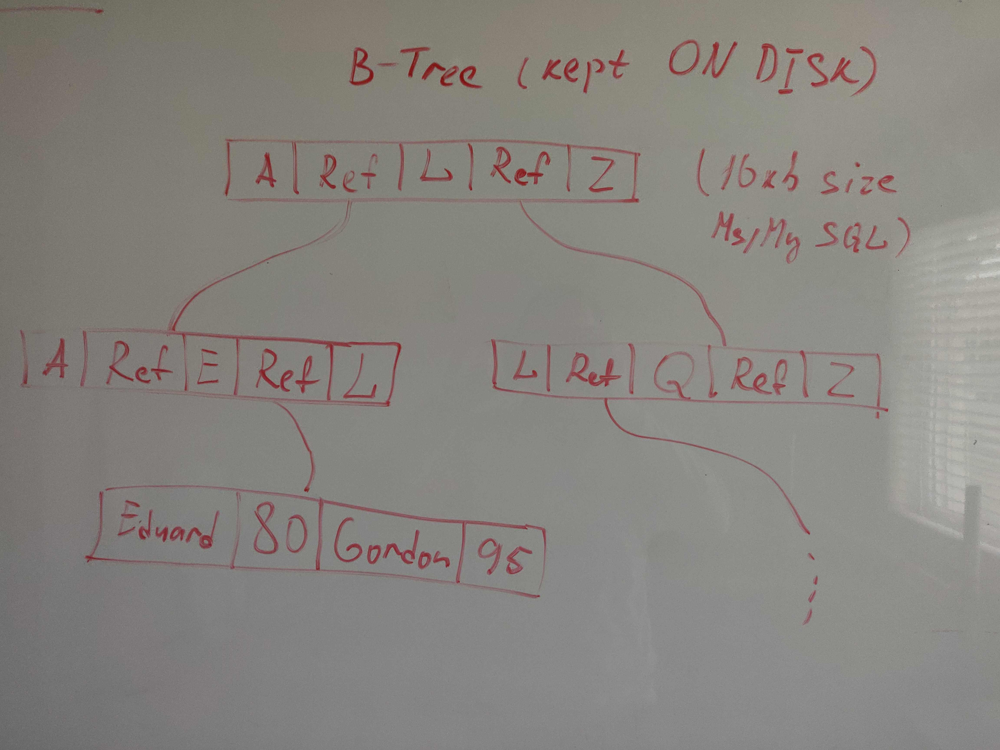

# [**Database Indexes**]()
* [Hash Indexes](https://www.youtube.com/watch?v=I1wQsY-Nh_k)
* [B-Trees](https://www.youtube.com/watch?v=I1wQsY-Nh_k)
* [SSTables and LSM-Trees]()

# Backgroung:
* To read/write/query data we need to have at least O(logn) time, O(n) is REALLY slow on huge amount of data
* When we simply scan database log it takes O(n) time to find a record
* We can improve write/update to O(1) by using append only log, but read stays O(n) as long as we need to scan from the bottom to find a record

# Hash Indexes:
* Read/Write by Key -> Hash Function -> Memory Address
* Pros:
    * Really good for a small dataset
    * Works fast when dataset is in memory. Both read and write is O(1) 
* Cons:
    * Slow when on disk(hard drive) (read/write head can move a lot phisically)
    * No Range Queries

# B-Trees:
* Kept entirely on disk
* B-Tree should be ballanced to give O(logn) read time
* Insert is slow because if current page limit is exceeded we need to split a page and create new references in the parent page
* Pros:
    * Larger dataset - almost no limits
    * Performance is relatively good
    * Range queries
* Cons:
    * Not fast inserts

