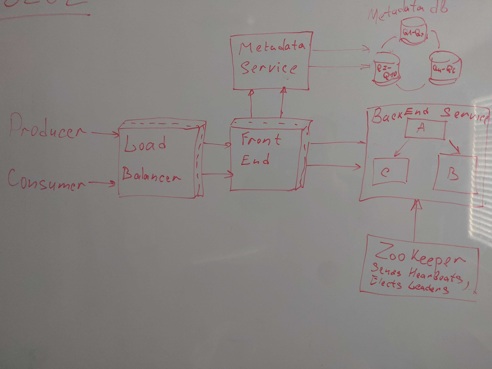

# [**Distributed Message Broker**]()
* [Link1](https://www.youtube.com/watch?v=e2iK8pUP9Vs)
* [Link2](https://www.youtube.com/watch?v=iJLL-KPqBpM)

# Functional Requirements:
* Scalable - handle load increase
* Highly Available - handle hardware and network failures
* Highly Performant - low latency
* Durable - once submitted, data is not lost

# NON Functional Requirements:
* Scale out to any level of usage
* Let's say million of messages per minute
* Message size - 200 bytes
* ~300 Gb per day

# API Design:
* publish_message(user_id, msg)
* consume_message(acknowledgement?)

# Database tables: 
* do we really need it or better to keep last messages in memory + disk

#  Architectural Overview: 
* In Memory based or Log based or Both?
* Load Balancing: DNS record -> VIP(virtual ip address)(can have many) -> Load Balancer(many) -> FrontEnd
* Message comes to the FrontEnd server(authentication, request/data validation, rate limiting)
* FrontEnd server gets Backend host address from Metadata service
* Publish Message is sent to selected BackEnd Host and data is replicated
* Receive Message is sent to selected BackEnd and data is removed(offset/marked as processed)
* BackEnd service:
    * Option1: Leader-Follower Replication 
        * Getting leader node from Metadata service
        * Write to a Leader node
        * Leader Node is responsible for a data replication
        * In-cluster manager(ZooKeeper) for a leader selection
    * Option2: Small cluster of independent hosts
        * Getting cluster id by calling Metadata service
        * Each cluster has 3-4 machines distributed accross data centers
        * Write to any node available in the cluster
        * Out-cluster manager - mapping between queues and clusters

