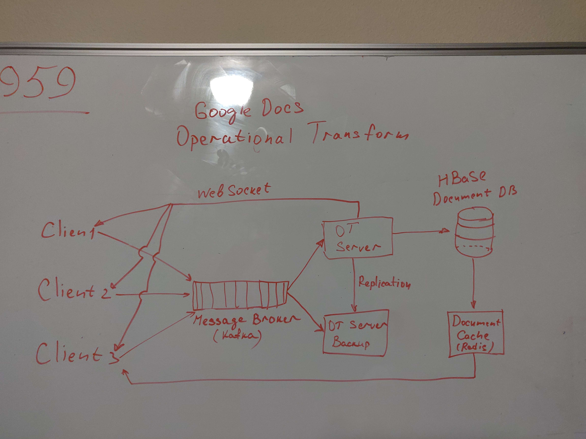
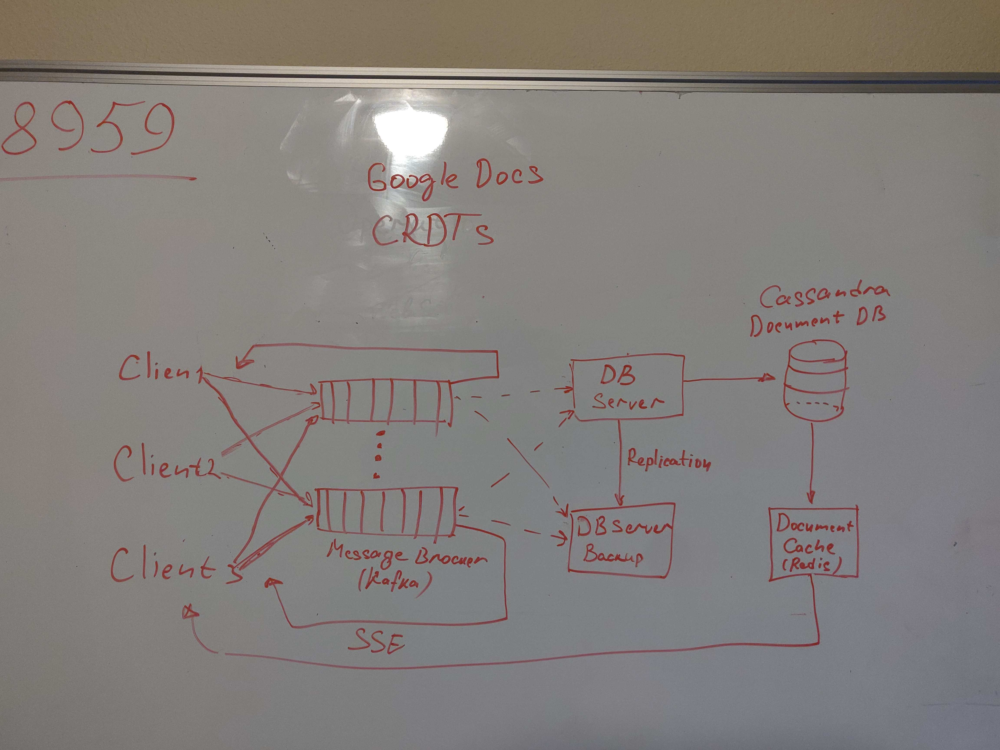

# [**Google Docs Design**](https://www.youtube.com/watch?v=WXxExjI9FnM)
[CRDTs video](https://www.youtube.com/watch?v=jIR0Ngov7vo)

# Functional Requirements:
* Edit text documents, support concurent editing (both online and offline)
* All clients eventually see the same version of the document 

# NON Functional Requirements:
* 1 Billion documents per day
* 1 Kb per each document on average
* 1 Tb storage per day
* 365 Tb per year
* More than 1 Pb per 5 years
* Sharding based on document id?

# API Design:
* fetch_document(document_id)
* insert_char(document_id, position, char)

# Database tables:
* users
* document_user
* documents

#  Architectural Overview: 
* Two algorithms to use:
    * Operational Transform
        * Two concurent editors of the same text and they are both  making their own edits
        * Both of the edits are applied locally and then sent from the server to the other client
        * All the writes that every single client is doing has to be routed through one single server
        * Downside - all writes have have to go through one single server (many clients write to the same document)
        * We can replicate OT server
        * We can have separate OT server for each document
    * CRDTs - Conflict Free Replicated Data types
        * State-Based CRDTs - entire state of CRDT is sent over the network
            * Every client has copy of document, whole document is sent over the network
        * Operation-Based CRDTs - only actual operation that changes the state of CRDT is sent over the network
            * Every client has copy of document, but only actual change is sent
    * In case of Google Docs Design - Operation-Based CRDT is better, documents can be large
    * Upside - it does not depend on order of changes
    * Downside - hard to implement properly

