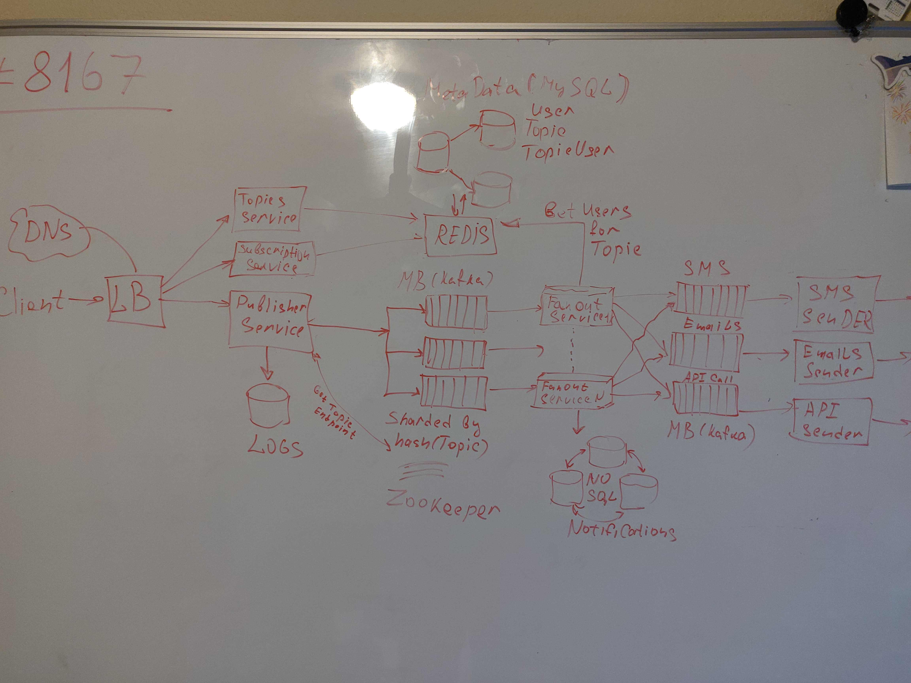

# [**Notification Service**]()
* [Link1](https://www.youtube.com/watch?v=bBTPZ9NdSk8)
* [Link2](https://www.youtube.com/watch?v=TpugGhXhdaU)

# Functional Requirements:
* Create Topic
    * Topic represents a named resource (bucket that stores messages from publisher)
* Publish
* Subscribe
    * All topic subscribers recive a message from a bucket
* No duplicates
* Keep/Store messages until they can be delivered

# NON Functional Requirements:
* Capacity:
    * 1 billion users who recive 100 notifications per day
    * 1 kb per message = 100 TB
* Scalability - support large amount of topics, publishers and subscribers
* Highly Available - no single point of failure
* Durable - messages are not lost

# API Design:
* create_topic(topic_id)
* publish(topic_id, message)
* subscribe(user_id, topic_id)
* fetch_notifications(user_id)

# Database tables: 
* users
* topics
* notifications

#  Architectural Overview: 
* Notification can be sent as email, sms, push notification, api endpoint call
* Message Broker: In Memory or Log-Based
* Use Idempotency keys to make sure that message has not been processed yet
* Kaffka queue is partitioned by topic_id
* Topic can have multiple users related to it

