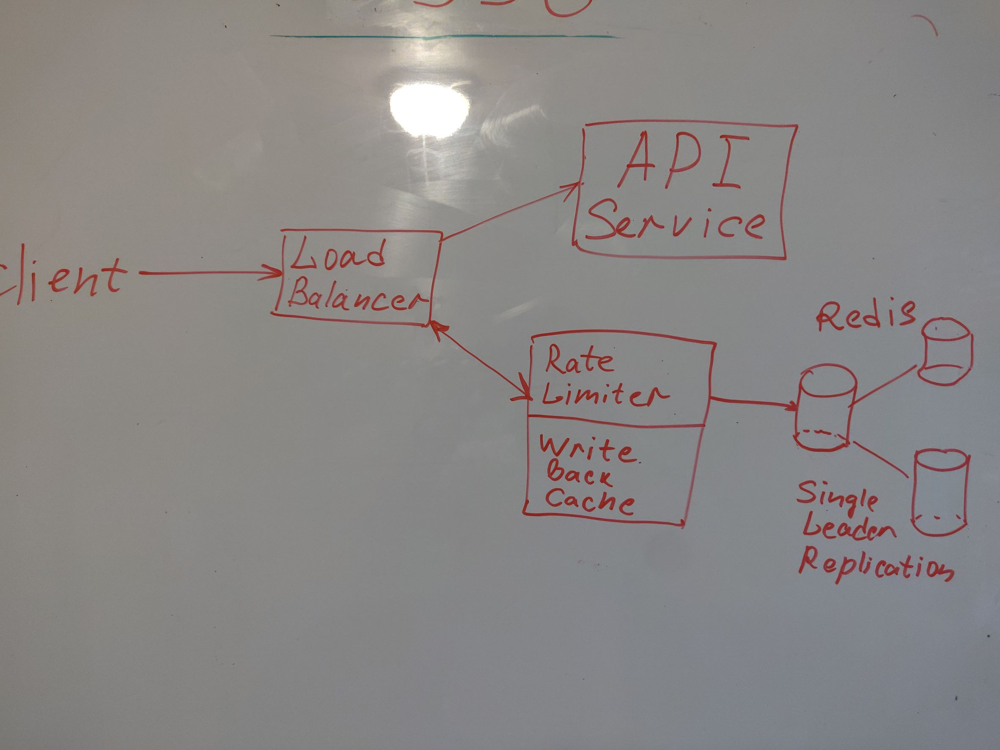

# [Rete Limiter Design](https://www.youtube.com/watch?v=MDH7xybVr8o)

# Functional Requirements:
* Limit entity to a certain amount of API requests over a given period of time
* Super low latency and not a single point of failure(fault tolerance)

# NON Functional Requirements:
* 1 million users
* userId(maybe api key/endpoint_name) - 8 bytes, timestamp - 4 bytes, counter - 4 bytes
* limit to 100 hundred requests per min
* if storing all requests using counter
    * 1 mil * (8+4+4) bytes = 16 Mb
* if storing every single request
    * 1 mil * 100 resq * (8+4)bytes = 1.2 Gb

# API Design:
* rate_limit(userId, endpoint_name, timestamp)

# Database tables: 
* do we need it?
* we need a really low latency, so let's keep it in memory(Redis/Memcached)

#  Architectural Overview: 
* Two types of rate limiters:
    * Fixed Window
        * You can make a predefined number of requests per min/hour/day...
        Dictionary<userId, (counter, timestamp)>
        Key => userId   limit 2 requests per min
            request1    (1, 12-01-15) - success at 12:01:15
            request2    (2, 12-01-30) - success at 12:01:30
            request3    (2, 12-01-45) - failed  at 12:01:45
            request4    (1, 12-02-15) - success at 12:02:15
        * Redis updates value for a key in a singe thread, no concurency/racecondition issues should pop up
    * Rolling window
        * Predefined number of requests for a rolling time window
        Dictionary<userId, LinkedList<TimeStamp>>
        Key => userId   limit 2 requests per min
        request1    [12-01-15] - success at 12:01:15
        request2    [12-01-15, 12-01-30] - success at 12:01:30
        request3    [12-01-15, 12-01-30] - failed  at 12:01:45
        request4    [12-01-30, 12-02-20] - success at 12:02:20
* Rate Limiting based on:
    * User ID
    * IP address
* Partiotion
    * Can be done based on userId
* Replication
    * One leader is more than enough
    * even if master node failed we can afford to lose some request and pick a new master
